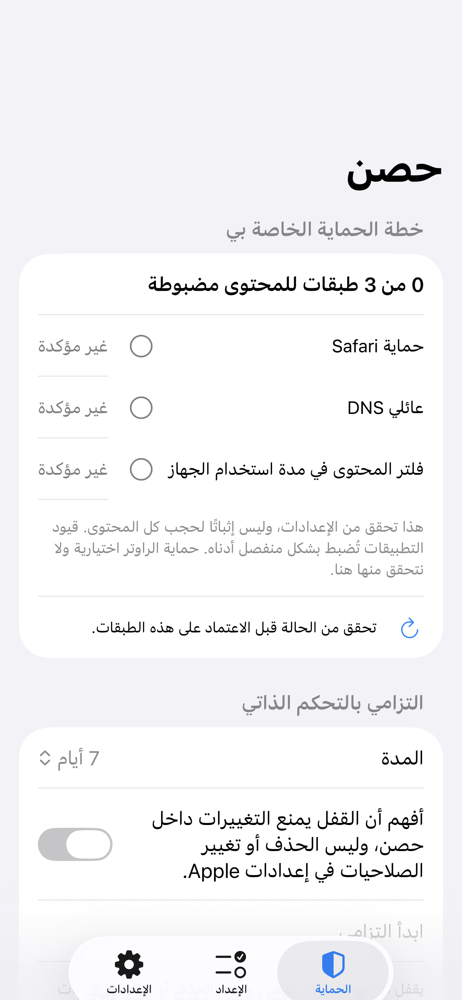
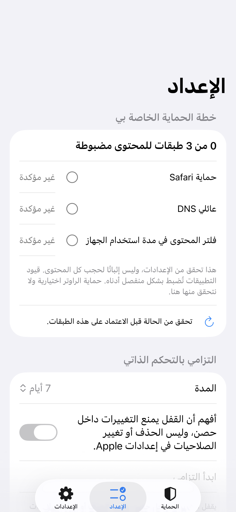
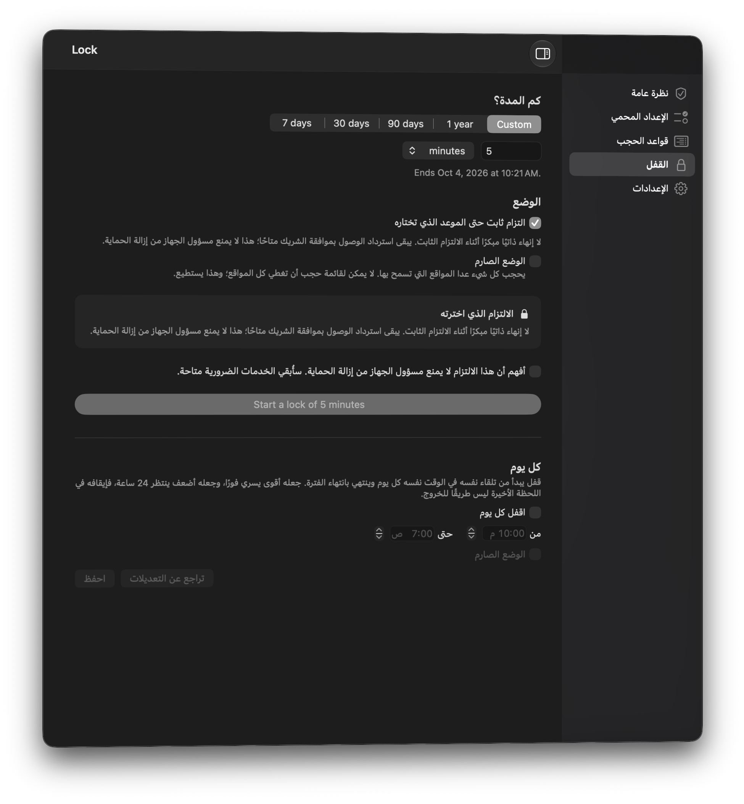

# Protection and commitment screen review

Scope: the initial Arabic phone overview/setup and Mac lock screen, captured from
the current native test hosts during this review. This is a bounded screenshot review,
not a full interactive audit or verification of real-world blocking.

## Step 1 — Phone overview: understandable, but too much repetition

Strengths: clear separation between configured content layers and the commitment;
unconfirmed configuration is not presented as active protection. Native labels,
right-to-left placement and wrapping are visible.

Risk: the readiness section takes most of the first screen, pushing the main
action below the fold. The overview and setup repeat the same commitment form.
Next design pass should keep a compact summary on overview and full controls on
setup, without hiding failed checks or removing access to current features.

## Step 2 — Phone setup: honest consent; action requires scrolling

Strengths: duration choice and explicit acknowledgment appear before a commitment
can start. The explanation does not promise deletion prevention in Apple Settings.

Risks: secondary text is small and light; actual contrast, larger Dynamic Type,
VoiceOver reading order and tap targets still need device testing. The unchecked
start action is disabled; this is deliberate, but the next action should be more
obvious for a new user. App restrictions and permissions are further down the list.

## Step 3 — Mac overview: visual review blocked

The bitmap snapshot produced unreadable native controls; the subsequent native
overview capture caught a window animation. Both were rejected as design
evidence. No visual-quality or accessibility-compliance claim is made for this
step. Behavioral policy tests remain independent of the screenshot review.

## Step 4 — Mac lock setup: readable; repeated explanation

Native window capture passed inspection. The fixed-commitment choice, strict
mode and acknowledgment are visible. No lock was started. The limit explanation
appears twice, using considerable space; a future pass should reduce repetition
without weakening consent. Secondary text in dark mode needs measured contrast
and keyboard/VoiceOver testing. The fixture uses an Arabic SwiftUI locale in an
English test process, so mixed-language generated strings do not prove a
fully Arabic production-language run.

## Delivered behavior and remaining validation

The cross-platform seven-day extension now requires confirmation. Mac extends
the fixed commitment horizon along with its deadline; mobile preserves the
original start and refuses overlong or failed persistence changes. Unit tests
cover these behaviors. These screenshots do not show an active lock or its
confirmation and therefore do not verify those interactions visually.

No device permissions or router settings were enabled during this review.
The important next acceptance step is a signed physical iPhone/iPad run covering
revocation, relaunch, persistence failure and real app shielding.
